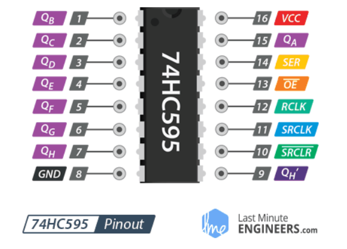
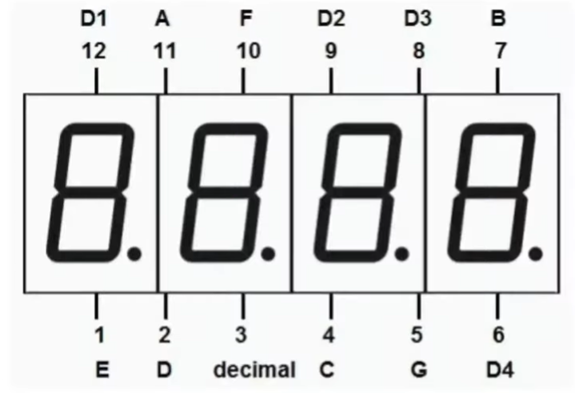
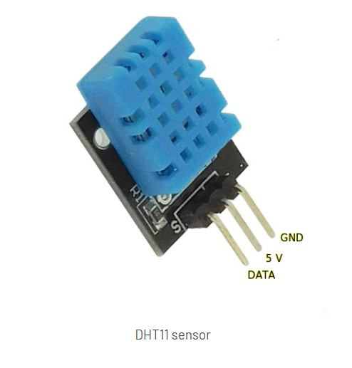

# Arduino Temperature and Humidity Display  
## Using 74HC595N, 4-Digit 7-Segment Display, and DHT11

## 1. Project Overview

This project uses:

- **Arduino Board**
- **DHT11 temperature and humidity sensor**
- **74HC595N shift register**
- **4-digit 7-segment LED display**

The system performs the following tasks:

1. Reads **temperature and humidity** from the DHT11 sensor.
2. Uses the **74HC595N shift register** to control the display segments while reducing the number of Arduino pins required.
3. Displays temperature and humidity values alternately on the **4-digit 7-segment display**.
4. Shows short labels (`tE` and `HU`) before displaying the corresponding values.

The 74HC595N allows the Arduino to control **8 display segments using only 3 pins**, which greatly simplifies the wiring.

---

# 2. Components Required

- 1 × Arduino Uno
- 1 × DHT11 sensor module
- 1 × 74HC595N shift register
- 1 × 4-digit 7-segment display
- 8 × resistors (220Ω–330Ω)
- Breadboard
- Jumper wires
- USB cable or battery power source

---

# 3. How the Circuit Works

A 4-digit 7-segment display contains:

- **8 shared segment lines:**  
  `A, B, C, D, E, F, G, DP`

- **4 digit control lines:**  
  `D1, D2, D3, D4`

The circuit works as follows:

- The **74HC595N controls the segment lines (A–G + DP)**.
- The **Arduino directly controls the digit select lines (D1–D4)**.
- The display is refreshed using **multiplexing**, meaning only one digit is active at a time, but switching happens very quickly so all digits appear lit.

---

# 4. Why the 74HC595N is Used

Without a shift register, the display would require:

- 8 Arduino pins for segments
- 4 Arduino pins for digit control

Total = **12 Arduino pins**

With the **74HC595N shift register**:

- 3 pins control all 8 segment outputs
- 4 pins control the digits

Total = **7 Arduino pins for the display**

---

# 5. Why 8 Resistors Are Needed

Each LED segment must have a current-limiting resistor.

Resistors are placed on the segment lines:

- A
- B
- C
- D
- E
- F
- G
- DP

Digit lines **D1–D4 do not require resistors** in this design.

---

# 6. Arduino Pin Assignment

| Arduino Pin | Function |
|---|---|
| 8 | 74HC595 SER (data) |
| 9 | 74HC595 SH_CP (clock) |
| 10 | 74HC595 ST_CP (latch) |
| 7 | DHT11 data |
| 2 | Display D1 |
| 3 | Display D2 |
| 4 | Display D3 |
| 5 | Display D4 |

---

# 7. Wiring the 74HC595N

The 74HC595N has **16 pins**.

## Power and control pins

| 74HC595 Pin | Name | Connect to |
|---|---|---|
| 16 | VCC | Arduino 5V |
| 8 | GND | Arduino GND |
| 14 | SER / DS | Arduino pin 8 |
| 11 | SH_CP / SRCLK | Arduino pin 9 |
| 12 | ST_CP / RCLK | Arduino pin 10 |
| 10 | SRCLR / MR | 5V |
| 13 | OE | GND |

## Reference 74HC595N Shift Register

---

# 8. 74HC595 Outputs to Display Segments

The shift register outputs control the segments through resistors.

| 74HC595 Output | Chip Pin | Through Resistor → Display Segment |
|---|---|---|
| Q0 | 15 | A |
| Q1 | 1 | B |
| Q2 | 2 | C |
| Q3 | 3 | D |
| Q4 | 4 | E |
| Q5 | 5 | F |
| Q6 | 6 | G |
| Q7 | 7 | DP |

Each output must go through a **220Ω–330Ω resistor** before connecting to the display.

---

# 9. Wiring the 4-Digit 7-Segment Display

The display has **12 functional connections**.

### Segment connections

Connect segments through resistors:

| Segment | Connected from |
|---|---|
| A | 74HC595 Q0 |
| B | 74HC595 Q1 |
| C | 74HC595 Q2 |
| D | 74HC595 Q3 |
| E | 74HC595 Q4 |
| F | 74HC595 Q5 |
| G | 74HC595 Q6 |
| DP | 74HC595 Q7 |

### Digit control connections

Connect digits directly to the Arduino:

| Display Digit | Arduino Pin |
|---|---|
| D1 | 2 |
| D2 | 3 |
| D3 | 4 |
| D4 | 5 |

These pins control which digit is active during multiplexing.

## Reference Display

---

# 10. Wiring the DHT11 Sensor

| DHT11 Pin | Connect to |
|---|---|
| VCC | Arduino 5V |
| GND | Arduino GND |
| DATA | Arduino pin 7 |

Most DHT11 modules already contain a pull-up resistor.

If using a **bare DHT11 sensor**, add a **10kΩ resistor between DATA and VCC**.

## Reference DHT11

---

# 11. Breadboard Wiring Procedure

### Step 1  
Place the **74HC595N across the center gap** of the breadboard.

### Step 2  
Connect:

- Pin 16 → 5V  
- Pin 8 → GND

### Step 3  
Connect:

- Pin 10 → 5V  
- Pin 13 → GND

### Step 4  
Connect Arduino control pins:

- Arduino pin 8 → pin 14 (SER)
- Arduino pin 9 → pin 11 (CLOCK)
- Arduino pin 10 → pin 12 (LATCH)

### Step 5  
Insert the **4-digit display** into the breadboard.

### Step 6  
Connect **Q0–Q7 through resistors** to the display segment pins.

### Step 7  
Connect display digit pins:

- D1 → Arduino pin 2
- D2 → Arduino pin 3
- D3 → Arduino pin 4
- D4 → Arduino pin 5

### Step 8  
Connect the **DHT11 sensor**:

- VCC → 5V
- GND → GND
- DATA → pin 7

### Step 9  
Ensure **all components share a common ground**.

---

# 12. Software Logic

The Arduino program performs four tasks.

## 1. Read the sensor

The Arduino reads:

- temperature
- humidity

from the DHT11 sensor.

---

## 2. Convert values for display

Temperature is stored with **one decimal place**.

complete code at folder main/docs/main.ino

---

## 3. Send segment data to the shift register

The Arduino sends **8 bits** to the 74HC595:

These bits determine which segments turn on.

---

## 4. Multiplex the digits

The Arduino quickly cycles through:

Each digit is activated for a few milliseconds.

Because this happens very fast, the display appears stable.

---

# 13. Display Sequence

Because 7-segment displays cannot clearly show many letters, simplified labels are used.

The display cycle is:
-tE
-temperature displayed
-HU
-humidity displayed

Then the sequence repeats.

---

# 14. Testing Procedure

### Test the sensor

Upload a simple sketch and confirm that **temperature and humidity appear in the Serial Monitor**.

### Test the display

Run a simple program to turn on all segments of a single digit.

### Test segment mapping

Turn on **one segment at a time** to verify wiring.

### Combine the systems

After both the sensor and display work separately, run the final program.

---

# 15 Final Result 

# 16. Final Result

After completing the wiring and uploading the program, the system will:

- read temperature and humidity from the DHT11
- control the display using the 74HC595 shift register
- multiplex the 4-digit display
- alternate between temperature and humidity readings

This project demonstrates:

- sensor interfacing
- shift register control
- multiplexed LED display driving
- embedded systems programming with Arduino

